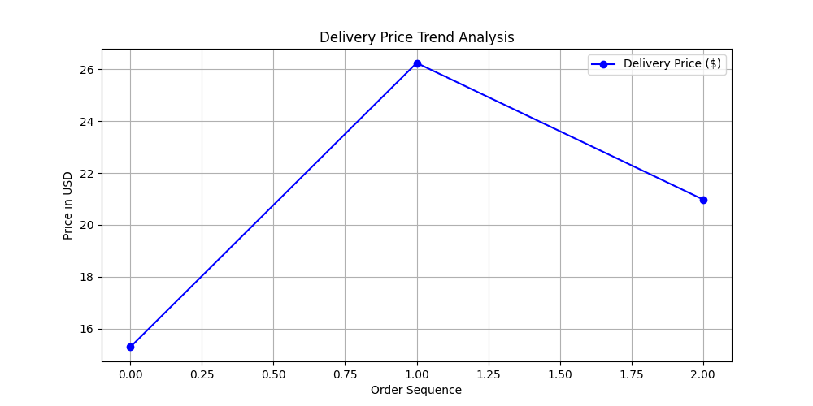

# US Logistics AI Optimizer (v2.5)

An intelligent logistics pricing engine that combines **historical data analysis**, **real-time weather conditions**, and **AI-driven predictions**.

---

##  Key Features
**Live NYC Weather Integration:** Automatically fetches real-time weather data from New York via Open-Meteo API.
**Dynamic Pricing:** Calculates logistics costs using a weather-based surge multiplier ($°F$ support).
**AI Insights:** Predicts market volatility and future pricing trends using a specialized `DeliveryAI` engine.
**Data Visualization:** Generates automated price trend reports for stakeholders.

---

## Live Market Analysis
The following graph shows the real-time price fluctuations based on the latest New York market conditions and AI predictions:



> **Current Market Status:** The system is currently monitoring New York City (40.71, -74.00) for real-time adjustments.

---

## Technical Stack
* **Language:** Python 3.14.2
* **Data Handling:** JSON & Python Dictionaries
* **API:** Open-Meteo (Real-time Weather)
* **Visualization:** Matplotlib
* **Version Control:** Git & GitHub

---

## 🚀 How to Run
1. Install dependencies:
   ```bash
   pip install requests matplotlib