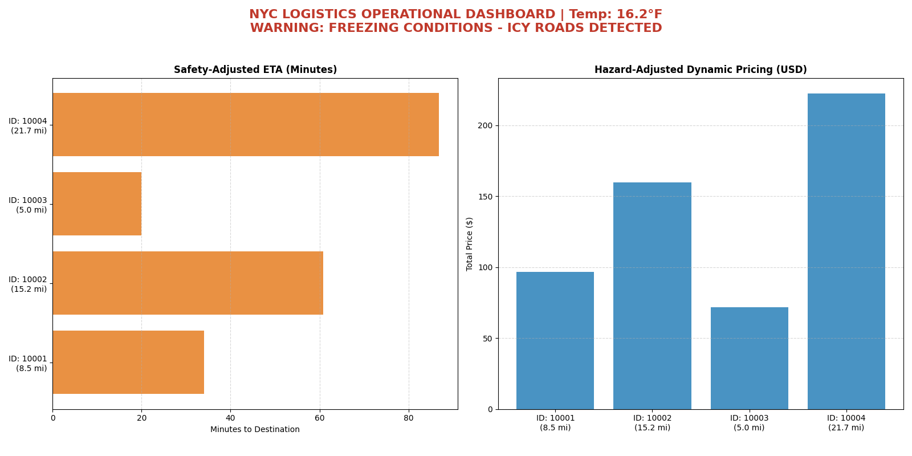

# NYC Smart Logistics & Dynamic Pricing Engine

A professional-grade logistics analytics tool designed for New York City fleet operations. This engine integrates real-time weather APIs and temporal traffic data to calculate high-precision **Dynamic Pricing** and **Safety-Adjusted ETA**.

## Live Dashboard Preview
The system generates a dual-panel analytical dashboard for operational oversight:


## Core Features

### 1. Intelligent Pricing (Surge Logic)
- **Traffic Multiplier:** Automatically detects NYC rush hours (08:00-10:00 & 16:00-19:00) and applies a **1.35x** surge.
- **Weather Impact:** Integrates Open-Meteo API to apply pricing multipliers based on rain, snow, or storm conditions.
- **Hazard Surcharge:** Detects "Freezing Cold" (temp ≤ 32°F) and adds a significant risk premium to the final price.

### 2. Operational ETA Analysis
- **Imperial System:** All distances are processed in **Miles** and speeds in **MPH**.
- **Dynamic Speed Adjustment:**
  - **Normal:** 25 MPH average city speed.
  - **Hazardous (Icy/Snowy):** Automatically throttles to 15 MPH for safety-first estimation.
- **Route Tracking:** Visualizes specific NYC routes (e.g., Manhattan to Brooklyn) with real-time delay markers.

### 3. Professional Visuals
- **Orange/Blue Palette:** High-contrast color scheme for quick data readability.
- **Hazard Alerts:** Red-themed visual warnings triggered during freezing conditions or icy road detections.

## Technical Stack
- **Language:** Python 3.14.2
- **Libraries:** `matplotlib` (Visualization), `requests` (API Handling), `json` (Data Storage)
- **API:** Open-Meteo (Real-time NYC Weather)

## Project Structure
- `main.py`: The orchestrator that runs the entire pipeline.
- `analytics.py`: The core logic engine containing the `LogisticsEngine` class.
- `orders.json`: Data source containing driver IDs, routes, and base mileage.
- `logistics_dashboard.png`: The automated visual output.

## How to Run
1. Clone the repository.
2. Install dependencies: `pip install requests matplotlib`
3. Run the application: 
   ```bash
   python main.py